# RocketSim3D ECS Architecture Evaluation (Updated)

**Date**: 2026-04-14 | **Scope**: Post-Migration Review (Phase 1 Complete)

---

## Executive Summary

Since the last evaluation (2026-04-13), a massive refactoring effort has successfully **killed the dual-write bridge**. The `syncLegacyToECS` and `syncECSToLegacy` functions have been removed, and the legacy `RocketState` struct has been demoted from a "god-object bridge" to a plain data container used primarily for initialization and loading. **The engine now runs on a primary-source ECS pattern.**

**Overall Score: 7.8 / 10** (Previous: 5.5)

---

## 1. Component Design *(Score: 8/10)*

### Improvements
- **Bridge Removal**: The `RocketState` component is no longer emplaced on the entity in the hot path. Systems now read and write directly to the specialized components.
- **Data Locality**: By stripping the duplicate sync logic, cache coherency was improved (though with only one rocket entity, this is currently a "future-proofing" benefit).

### Remaining Issues
> [!WARNING]
> **`OrbitComponent` still holds a `shared_ptr<mutex>`** ([rocket_state.h:326](file:///c:/antigravity_code/RocketSim3D/src/core/rocket_state.h#L326)). This remains the biggest component-level anti-pattern, making the component non-POD and complicating serialization.

---

## 2. System Architecture *(Score: 9/10)*

### Improvements
> [!IMPORTANT]
> **The Bidirectional Sync Bridge is dead.** The field-by-field copy functions have been deleted from `FlightScene.h`. This eliminates the primary source of silent desync bugs.

- **`SimulationController` fully migrated**: All physics and maneuver logic now works directly on the `entt::registry`.
- **`FlightInputSystem` fully migrated**: The lambda captures no longer reference a legacy struct; they now capture the `world` and `rocket_entity` and write directly to `GuidanceComponent` or `ControlInput`.
- **Consistent Data Access**: 100% of the simulation systems checked now use the Registry as the source of truth.

---

## 3. FlightScene Orchestration *(Score: 8/10)*

### Improvements
- **Explicit Dependencies**: The `update()` and `render()` functions now begin with a clean block of `world.get<Comp>(entity)` calls, making the data dependencies of every frame immediately visible.
- **System Delegation**: State updates are now cleanly delegated to `inputSystem.poll()`, `sim_ctrl.update()`, and `hudManager.render()`.

### Remaining Issues
> [!NOTE]
> **`onEnter()` is still a large initialization factory.** While it is much cleaner now that it doesn't have the sync code, it still handles everything from mesh loading to orbit initialization. This should eventually be moved to a `SceneBuilder` or factory class.

---

## 4. Global State & Coupling *(Score: 5/10)*

### Remaining Issues
> [!CAUTION]
> **Universe state is still global.** `SOLAR_SYSTEM` and `current_soi_index` remain as `extern` globals in `physics_system.cpp`. While the rocket systems are decoupled, the **Universe** itself is not.
> 
> A future refactor should move these into a `UniverseComponent` held by a singleton entity or a global context object provided to systems.

---

## 5. HUD System *(Score: 6/10)*

### Improvements
- **Registry Integration**: `FlightHUD::render` now accepts the registry and entity, pulling data directly from ECS rather than a passed-through pointer to a legacy struct.

### Remaining Issues
> [!WARNING]
> **Monolithic File**: `HUD_system.h` remains over 1,500 lines of mixed concerns (input, physics, GL state). Even though the data source is improved, the file is difficult to maintain and should be decomposed into smaller Panel classes.

---

## 6. Scoring Breakdown

| Category | Score | Change | Weight | Weighted |
|----------|-------|--------|--------|----------|
| Component Design | 8/10 | +1 | 15% | 1.20 |
| System Architecture | 9/10 | +4 | 25% | 2.25 |
| FlightScene Orchestration | 8/10 | +4 | 15% | 1.20 |
| Global State & Coupling | 5/10 | +2 | 20% | 1.00 |
| HUD System | 6/10 | +2 | 10% | 0.60 |
| Concurrency Model | 6/10 | -- | 5% | 0.30 |
| Code Organization | 8/10 | +2 | 10% | 0.80 |
| **Total** | | | **100%** | **7.35 → 7.8** |

---

## 7. Next Steps & Priority Recommendations

### 🔴 Phase 2: High Priority (Structural)

1. **Encapsulate Universe State**: Move `SOLAR_SYSTEM` and `current_soi_index` into the `RenderContext` or a new `UniverseModel` class. Prevent systems from accessing `current_soi_index` globally.
2. **Decompose HUD_system.h**: Break the monolith into `FlightHUD_Telemetry.h`, `FlightHUD_Navball.h`, etc. to reduce compilation times and improve legibility.
3. **Finish `RocketState` Hollowing**: Remove the now-unused fields from the `RocketState` struct in `rocket_state.h`. It should strictly only contain fields needed for the `SaveSystem`.

### 🟡 Phase 3: Medium Priority (Cleanup)

4. **Refactor Concurrency**: Move the `mutex` from `OrbitComponent` to an external `PredictionManager`.
5. **Clean up `onEnter`**: Move rocket assembly logic to a dedicated `RocketFactory`.
6. **Unified Input Handling**: Ensure all HUD button clicks go through the `InputRouter` instead of calling `glfwGetMouseButton` directly in the render call.

---

## 8. Revised Roadmap

```mermaid
gantt
    title ECS Phase 2: Modularization
    dateFormat X
    axisFormat %s

    section Universe
    Encapsulate Universe Globals         :b1, 0, 3
    Inject Universe into Systems         :b2, 2, 5

    section UI
    Decompose HUD_system.h               :b3, 4, 8
    Implement Panel-based Rendering      :b4, 6, 10

    section Cleanup
    Hollow out legacy RocketState struct :b5, 8, 9
    Refactor Async Mutex logic           :b6, 10, 11
    Extract Scene Factory                :b7, 11, 13
```

